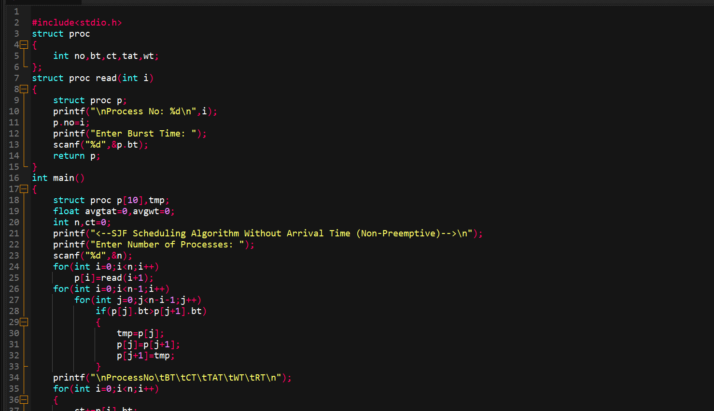

# CPU Scheduling Simulations in C

## 1. SJF Without Arrival Time (Non-Preemptive)

### Program Code:

### Output:

### Analysis:
This C program demonstrates the **non-preemptive Shortest Job First (SJF)** scheduling algorithm, assuming that **all processes arrive at time zero**. It begins by defining a structure to store process information, including process ID, burst time, completion time, turnaround time, and waiting time. The `read` function collects burst times for each process through user input.

In the `main` function, the program reads the total number of processes and their respective burst times. It then uses **bubble sort** to arrange the processes in ascending order of burst time. Once sorted, the program calculates the completion time for each process, then derives the turnaround time (equal to completion time since arrival time is 0) and waiting time (turnaround time minus burst time). Finally, it displays a formatted table summarizing each process's metrics and computes the **average turnaround time and average waiting time** for all processes.

---

## 2. SJF With Arrival Time (Non-Preemptive)

### Program Code:
  

### Output:

### Analysis:
This C program implements the **non-preemptive SJF algorithm** that takes **arrival times into account**. Each process is represented using a structure that includes process ID, arrival time, burst time, start time, completion time, turnaround time, and waiting time.

After reading the number of processes and their respective burst and arrival times, the program first sorts all processes by arrival time. If multiple processes arrive simultaneously, the one with the shortest burst time is given priority. The main scheduling loop then selects the shortest job from those that have already arrived by the time the CPU becomes free. If the CPU is idle (i.e., the next process hasn't arrived yet), it waits until the process becomes available.

For each scheduled process, the program calculates the start time, completion time, turnaround time (completion - arrival), and waiting time (turnaround - burst). It concludes by printing a table of these details and computing **average turnaround and waiting times**, offering a complete simulation of SJF with dynamic arrival times.

---

## 3. SRTF (Preemptive) – Case Example as per PPT

### Program Code:
  

### Output:

### Analysis:
This C program simulates the **Shortest Remaining Time First (SRTF)** scheduling algorithm, which is the **preemptive version** of SJF. The structure used for each process includes process ID, arrival time, burst time, remaining time (initialized with burst time), completion time, turnaround time, and waiting time.

After reading the input data, the program sorts processes by arrival time. The scheduling is handled via a **time-driven loop**, simulating each unit of time. At every time unit, the scheduler selects the process with the shortest remaining burst time among those that have already arrived. If a new process arrives with a shorter remaining time than the currently running process, **preemption occurs**, and the CPU switches to the new process.

As each process completes (when its remaining time reaches zero), the program records its completion time and calculates its turnaround and waiting times. At the end, it prints a detailed summary for each process and computes the **average turnaround time and waiting time**, demonstrating a complete and accurate SRTF simulation.
